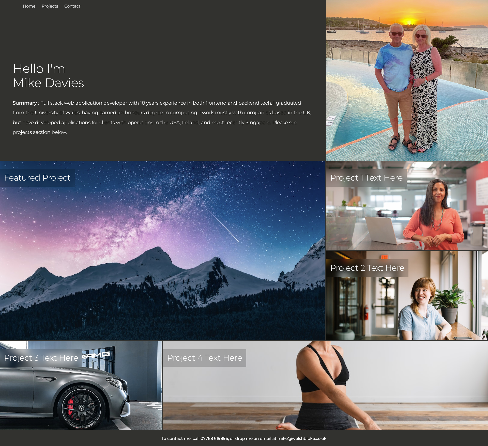
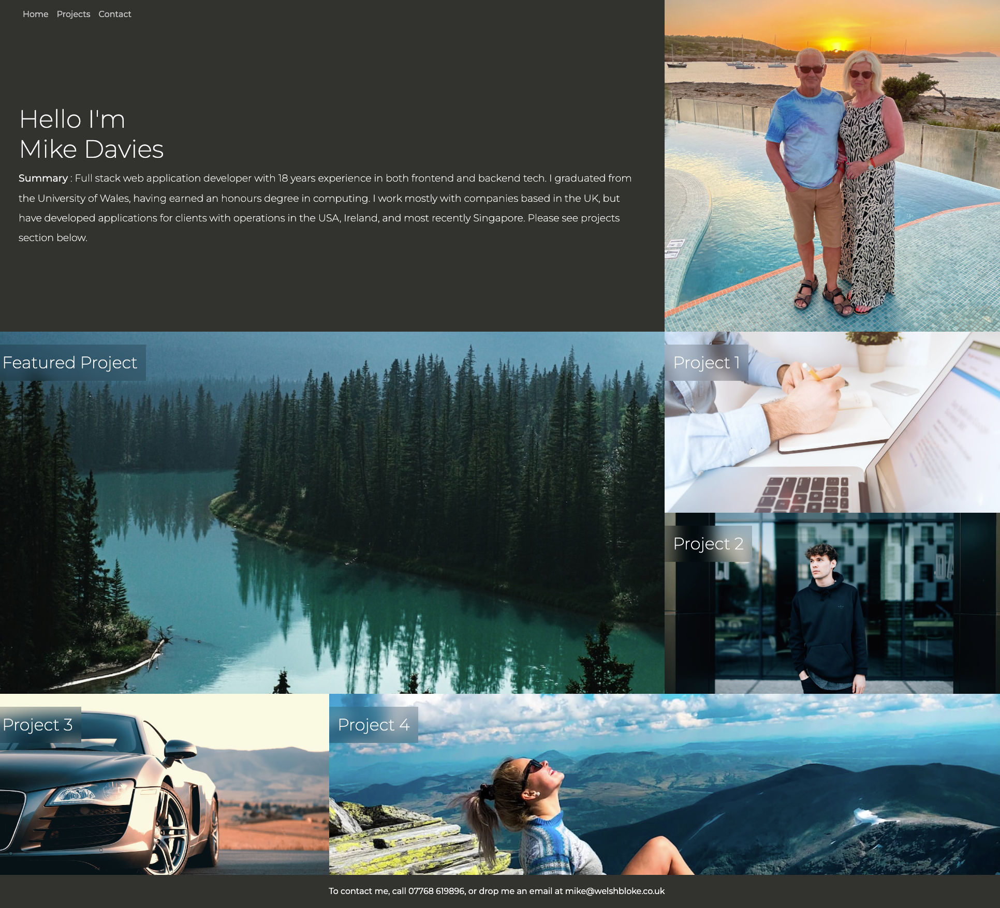
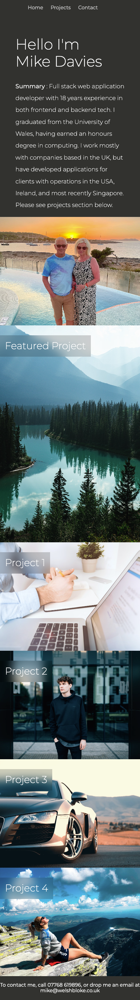

# Portfolio Challenge

## Description

This web page was created for the purpose of gaining experience working with modern CSS techniques, such as flexbox and CSS grid.

This web page was made responsive by using the following break points:

- [@media only screen and (max-width: 1200px) { ... }]
- [@media only screen and (max-width: 1000px) { ... }]

## Deployment

The application wa deployed to GitHub Pages using the following process:

- [Pushing the refactored files to a remote repository]
- [From the repository, select the Settings tab on the right side of the page]
- [In the section labeled Source, select the `main` branch as your source]
- [Click 'save']
- [The app is now available on GitHub Pages (see 'usage' below for access details)]

## Usage

To view the app visit:

https://welsh-bloke.github.io/portfolio-challenge/

The finished index.html page looks like the following screenshots:

## Large Screen

## 1200px Breakpoint

## 1000px Breakpoint

## Credits

[shields.io](https://shields.io/)

### Tutorials Used:

- [Markdown Guide](https://www.markdownguide.org/)

## License

Please refer to the LICENSE in the repo.
